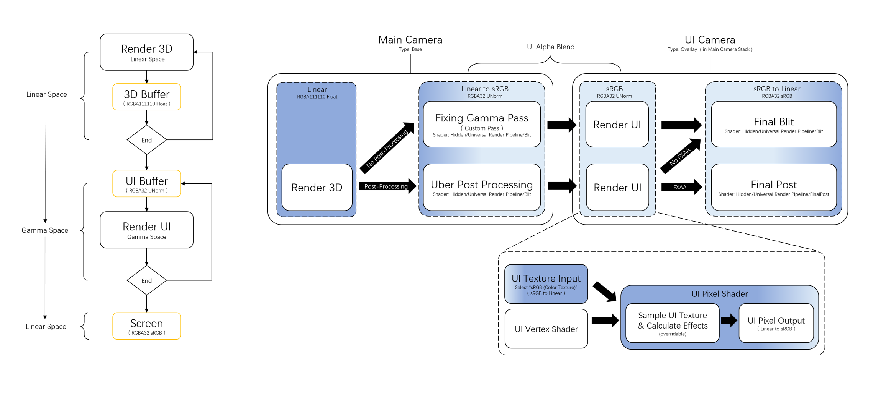

# UI Render Pipeline In Linear Space ( Developing... )
This project is an Unity render pipeline and shader framework for UI which is based on *Unity URP*.
We created it for the purpose of fixing the alpha value of the UI images ( opacity of images )  which is wrong in *linear color space*, 
that keep the sRGB workflow for the UI designers in Unity.

#### 线性空间 UI 渲染管线 ( 开发中... )

这个项目是一套基于 Unity URP 的 UI 渲染管线和 Shader 框架，
为了修复线性色彩空间中的的 UI 切图的透明度错误，
能够让 UI 设计师在 Unity 中保持原有的 sRBG 工作流。

#### リニア UI レンダーパイプライン ( 開発中... )

このプロジェクトは Unity URP に基づいて作った UI レンダーパイプラインとシェーダーフレームワークです、
Unity リニア の色空間にある UI 画像の透明さをなおす為に作れたものです。
ならば、UI デザイナーはいつもように sRGB の業務フローをすることができます。

# Versions and Schecdule

### Unity:
* Unity: 2020.3.21 f1c1  
* Unity UI: com.unity.render-pipelines.universal@10.6.0  
* Universal RP: com.unity.ugui@1.0.0  

### Feature:
* In our Render Pipeline,the UI images have the same opacity with images which are in the PhotoShop.

* UI Render with Individual resolution.

  
  

### Update:
* 11 / 05 / 2021:  
  Supported correct UI alpha gamma in case of Post-Processing;  
  Fixed the wrong effects of baked Reflection Probe;  
  Fixed the Gamma in Scene view;  
  
  
* 11 / 06 / 2021:   
  Supported correct UI alpha gamma in case of FXAA;  
 
  
* 11 / 12 / 2021:  
  Fixed the Color Depth resolution of 3D render.  
  
  
* 11 / 19 / 2021:  
  Fixed the the wrong effects of Reflection Probe in scene view.  
  Fixed the the wrong effects of Transparent Objects in scene view.
  
* 11 / 28 / 2021:  
  Supported UI Render with Individual resolution.

### Plan:
* To Develop Camera Managing Script. 

# Pipeline Flowchart

## Why using *RGBA32 UNorm* for the UI Buffer
When the final 3D render image is blit into the UI buffer, and transform to the Gamma Space, 
we can compare the resolutions of Color Depth in different graphics format of the UI Buffer.
Evidently the RGBA32 UNorm has the more details.  

